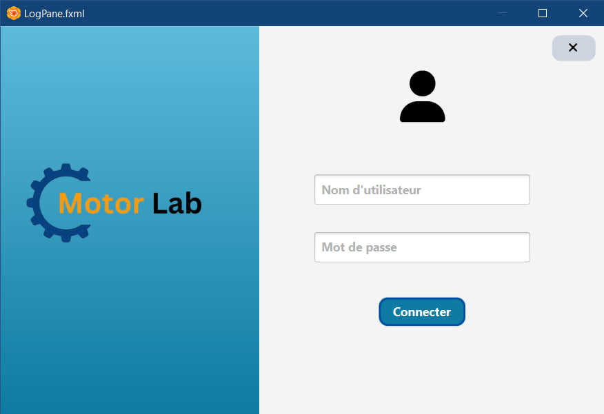
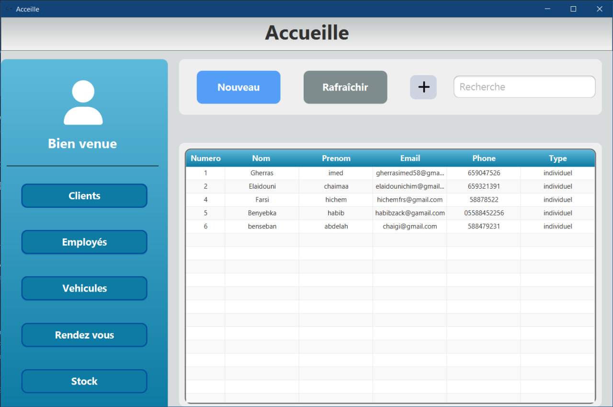
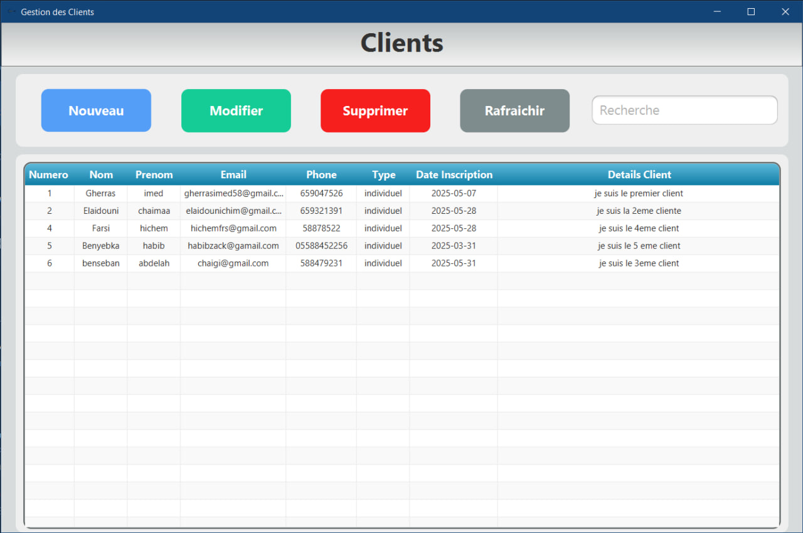

# 🚗 Car Management System

A **Car (Garage) Management System** built with:

- 🖥️ **JavaFX** (for the user interface)
- 🗄️ **Microsoft SQL Server (MSSQL)** (for the database backend)

This project allows managing cars, clients, employees, reservations, stock management.

---

## 🛠 Technologies Used

- **JavaFX** (Desktop GUI)
- **Java 23**
- **SQL Server 2022**
- **JDBC** for database connection

---

## 📷 Screenshots

### 🔐 Login Screen

### 📊 Dashboard

### 👤 Client Management

